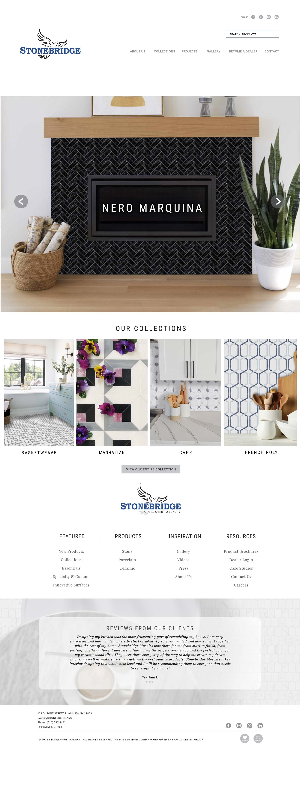

# STONEBRIDGE

## Welcome! 👋

Thanks for checking out this project.

This project was designed by [Frasca Designed Group](http://frascadesigngroup.com/) and coded into a WordPress Theme by me.

## The Project

The Project was to convert a PSD file to a WordPress theme using HTML, CSS, JS and PHP

### Links

- Live Site URL: [See Finished HTML Site](https://mos-zaid.github.io/stonebridge/)

## My process

- Wrote the front-end code to match the design file (PSD)
- Converted the Front-end (HTML, CSS and JS) to a WordPress theme
- Installed Woocommerce and various other WordPress Plugins
- Customized the woocommerce theme to match the design files (PSD)

### Built with

- Bootstrap Grid
- WordPress
- Woocommerce
- Mobile first
- Lazy Loading images

## My Proposed Improvements
- Improve Google page speed insights from 95% to 100%
- Make HTML more readable
- Make CSS more readable
